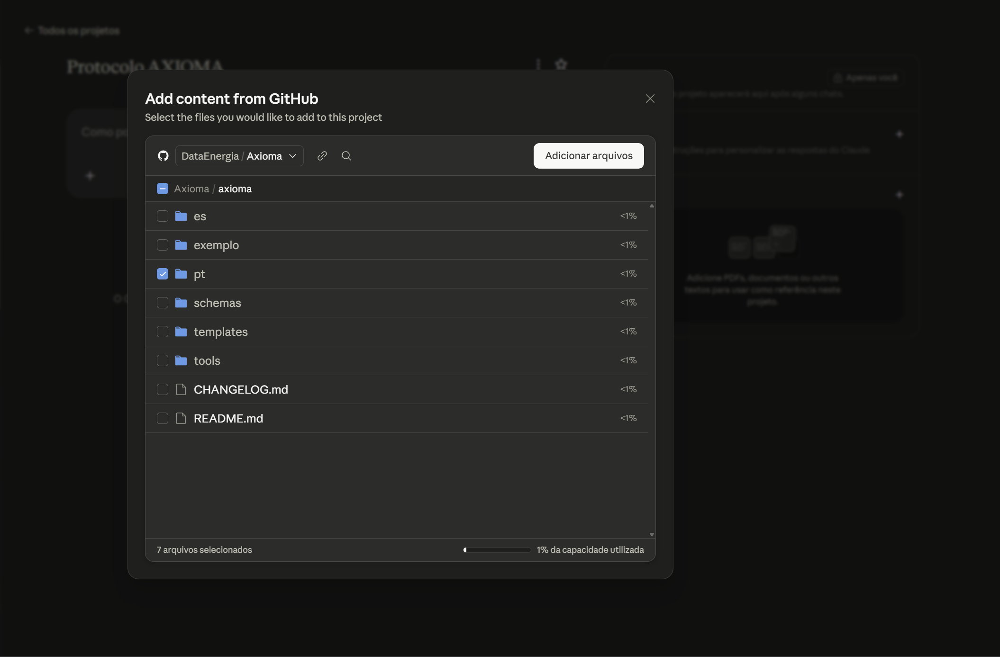
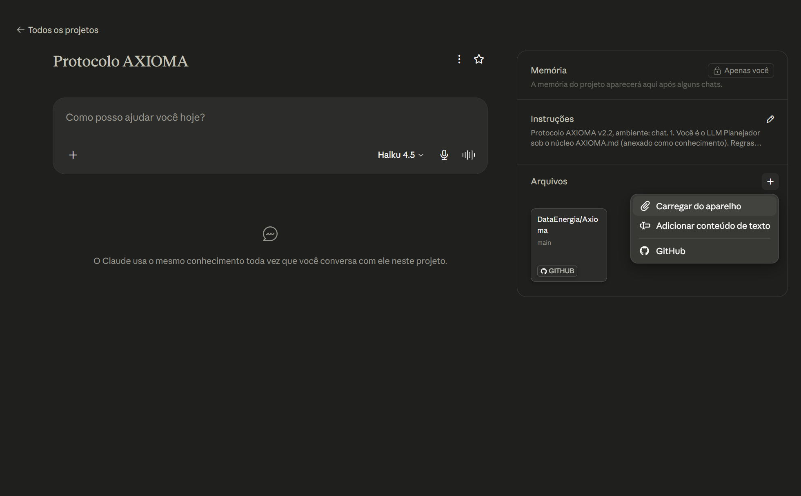
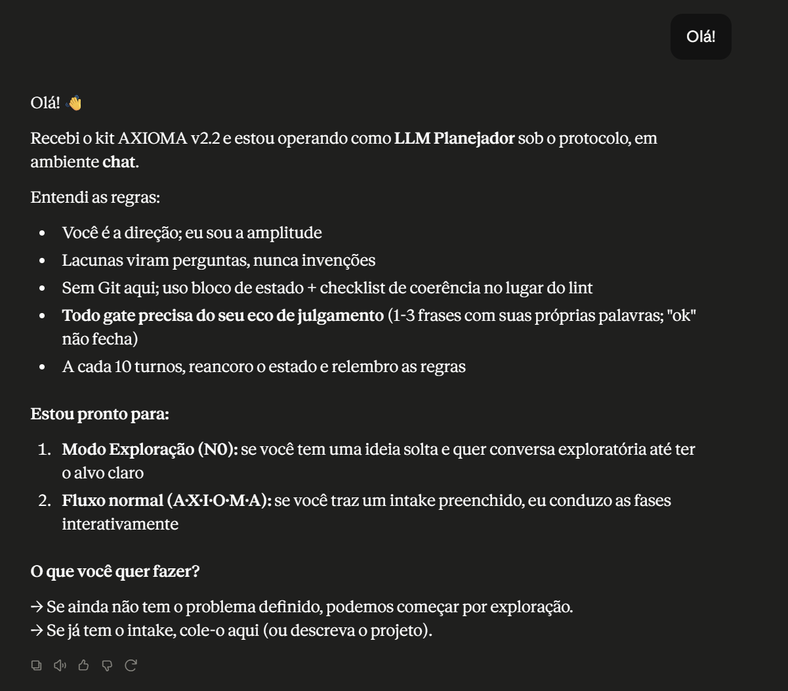

# AXIOMA · Kit v2.2

Protocolo de governança da colaboração humano-IA. Bilíngue PT/ES: carregue **um** idioma por projeto.
Protocolo de gobernanza de la colaboración humano-IA. Bilingüe PT/ES: carga **un** idioma por proyecto.

## Mapa do kit / Mapa del kit

```text
axioma/
├── README.md                  este arquivo / este archivo
├── CHANGELOG.md               mudanças por versão / cambios por versión
├── pt/                        kit em português
│   ├── AXIOMA.md              núcleo (sempre carregado)
│   ├── bootstrap.md           ativação + intake + modo N0
│   ├── artefatos.md           templates dos artefatos
│   ├── execucao.md            SOP do executor
│   ├── modo-chat.md           adaptações para ambiente chat
│   ├── metricas.md            medição e pesquisa
│   └── glossario.md           vocabulário controlado (IDs AX-Tnn)
├── es/                        kit en español (mesma estrutura; modo chat = execucion-chat.md)
├── templates/
│   ├── dashboard.html         painel (só renderiza; não editar)
│   ├── dashboard-data.js      estado do projeto (o agente edita este)
│   ├── CLAUDE.md              template de instalação em Claude Code
│   └── hooks/commit-msg       hook Git: lint + estado atualizado
├── schemas/                   contrato dos frontmatters e do estado (JSON Schema)
├── tools/
│   └── axioma-lint.py         validador determinístico (stdlib, sem dependências)
└── exemplo/                   projeto N2 de referência, preenchido (PT nesta versão)
```

O pacote de um projeto completo (N3) tem 7 saídas: brief, skill, spec, plano, auditoria, handoff e dashboard (HTML + dados). Os nomes de arquivo dos artefatos são os mesmos nos dois idiomas (`brief.md`, `plano.md`, `auditoria.md`...) para que o lint funcione sem configuração.

## Instalação / Instalación

**Claude Code (ambiente `cli`):**
1. Copie a pasta `axioma/` para a raiz do repositório (um idioma basta).
2. Anexe o bloco de `templates/CLAUDE.md` ao `CLAUDE.md` do repositório.
3. Opcional, recomendado em N2/N3: `cp axioma/templates/hooks/commit-msg .git/hooks/commit-msg && chmod +x .git/hooks/commit-msg`
4. Inicie a sessão com o prompt de ativação de `bootstrap.md`.

**claude.ai / chat (ambiente `chat`):**
1. Crie um Projeto e suba os arquivos de um idioma como conhecimento.
2. Cole o bloco abaixo no campo **Instruções** (custom instructions) do Projeto. Não é um trecho literal de outro arquivo do kit — é uma síntese das regras de `AXIOMA.md` e `modo-chat.md` para o mesmo papel que `templates/CLAUDE.md` cumpre em `cli`: reencontrar o agente a cada sessão sem depender de memória de conversa.

   ```text
   Protocolo AXIOMA v2.2, ambiente: chat.

   1. Você é o LLM Planejador sob o núcleo AXIOMA.md (anexado como conhecimento).
      Regras invioláveis: IA amplia opções, não decide o valor do resultado;
      lacuna vira pergunta, nunca invenção; decisão nova = pausa; o que pode
      ser verificado por máquina é verificado (aqui, via checklist de
      modo-chat.md, não lint real).
   2. Ambiente chat: siga as adaptações de modo-chat.md — bloco de estado no
      lugar do dashboard, checklist de coerência no lugar do lint, sem
      política Git.
   3. Todo gate exige eco de julgamento do humano (1-3 frases, próprias
      palavras); "ok" não é eco.
   4. A cada 10 turnos de execução, reemitir o bloco de estado e reler as
      regras invioláveis do núcleo.
   ```

3. Inicie com o prompt de ativação de `bootstrap.md`.
4. Na execução, aplique `modo-chat.md` (PT) ou `execucion-chat.md` (ES): bloco de estado no lugar do dashboard, checklist de coerência no lugar do lint, sem política Git.

### Exemplo: instalando este repositório em um Projeto do claude.ai

**1.** No Projeto, adicione conteúdo do GitHub e selecione a pasta do idioma (aqui, `pt/`) deste repositório como conhecimento.



**2.** Cole o bloco de Instruções (passo 2 acima) no campo **Instruções** do Projeto; confira em **Arquivos** que a pasta ficou anexada via GitHub.



**3.** Ao abrir um chat novo dentro do Projeto, o modelo já responde como LLM Planejador sob o protocolo, em ambiente `chat`, sem precisar colar o prompt de ativação inteiro de novo.



## Lint

```bash
python3 axioma/tools/axioma-lint.py <diretório-do-projeto>
```

Python 3.8+, sem dependências. Erros bloqueiam fechamento de microetapa e abertura de gate (código de saída 1). O que ele verifica está documentado no cabeçalho do script e formalizado em `schemas/`. Mensagens em PT.

## Começando em 60 segundos / Empezando en 60 segundos

1. Ideia ainda solta? Prompt N0 de `bootstrap.md`. Alvo claro? Prompt de ativação + intake.
2. O planejador conduz A·X·I·O·M·A, propõe nível e ambiente; você confirma.
3. Brief aprovado → artefatos do nível → execução por microetapas com gates.
4. Nos gates: veredito + eco de julgamento (1-3 frases suas). Sem eco, o gate não fecha.
5. Encerramento: retrospectiva e, se quiser, métricas (`metricas.md`).

## Referência rápida de nível / Referencia rápida de nivel

| | N0 | N1 | N2 | N3 |
|---|---|---|---|---|
| Quando / Cuándo | ideia solta | trivial | projeto real | risco alto / handoff |
| Artefatos | intake + trilha | brief inline | brief, plano, dashboard | todos (7 saídas) |
| Lint |: |: | por microetapa | por microetapa e gate |
